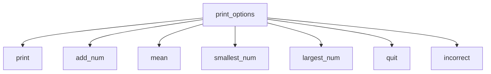

# Section 11 Challenge: Functions  
**Modular Number List Manager**

## 🎯 Objective  
Demonstrate function decomposition by creating a menu-driven program that:
- Separates concerns into discrete functions
- Uses pass-by-reference for vector modification
- Implements recursive menu navigation

## 🛠️ Function Architecture


## 📋 Function Specifications
| Function | Parameters | Returns | Responsibility |
|----------|------------|---------|----------------|
| `print_options` | `vector<int>&` | `void` | Main menu controller |
| `print` | `vector<int>&` | `void` | Display list contents |
| `add_num` | `vector<int>&` | `void` | Add number to list |
| `mean` | `vector<int>&` | `void` | Calculate average |
| `smallest_num` | `vector<int>&` | `void` | Find minimum value |
| `largest_num` | `vector<int>&` | `void` | Find maximum value |
| `quit` | none | `void` | Terminate program |
| `incorrect` | `vector<int>&` | `void` | Handle invalid input |

## 🚀 How to Run
```bash
g++ modular_number_manager.cpp -o number_manager
./number_manager
```

## 💡 Key Features
1. **Recursive Menu Flow**:
   ```cpp
   void print(vector<int>& numbers) {
       // ... display logic ...
       print_options(numbers); // Returns to menu
   }
   ```
2. **Pass-by-Reference Efficiency**:
   ```cpp
   void add_num(vector<int>& numbers) // Modifies original vector
   ```
3. **Defensive Programming**:
   ```cpp
   if (numbers.size() != 0) // Checks empty list
   ```

## 📝 Suggested Improvements
1. Add input validation for numbers
2. Implement persistent storage (file I/O)
3. Convert to iterative menu system
4. Add "clear list" functionality

## 🔍 Sample Execution
```
P- Print numbers
A- Add a number
M- Display mean
S- Display smallest
L- Display largest
Q- Quit

Choose one: A
Enter a number: 42
42 added

Choose one: P
[ 42 ]

Choose one: Q
Goodbye
```
